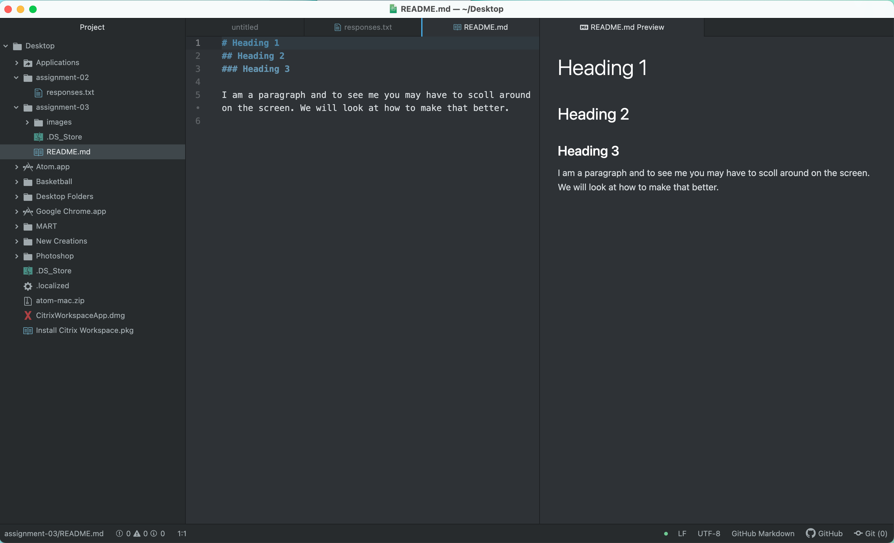

# Heading 1

# 3 Things I've Learned In This Class
1. The differece between an Absolute URL and a Relative URL is that an Absolute URL contains all of the protocols and information for a files location while the Relative URL does not. The Relative URL contains no protocols or domain information.

2. In our beginning units I learned alot of file types. Some image file types are JPEG, JPG, PNG, GIF, and a SVG. Some page types are HTML, HTM, and CSS. Lastly, some audio and video types are MP3, OGG, MP4, and WebM.

3. I learned that a VCS is a Version Control System that can be used as a way to remember all changes you have made. Using this helps because it allows the user to make changes that may or may not work because they can revert back to a prevous version. It also just makes sharing and collaboration easier because all associated parties can see the changes made between eachother.

[My Responses](./responses.txt)

