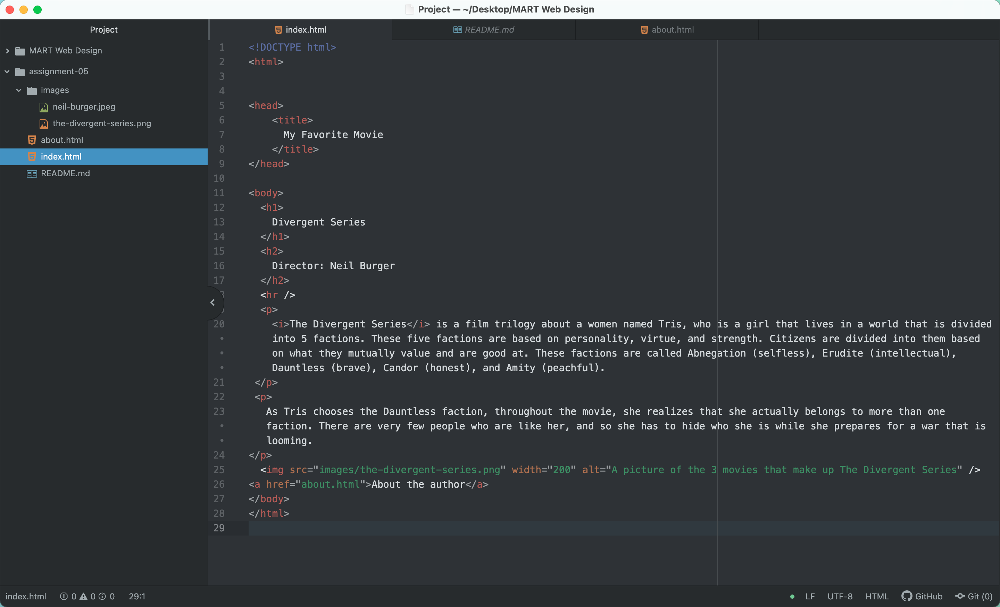

<h1>Tell me about a website you visited using The Wayback Machine. What year was it from? How is the older version different from the new version in terms of its overall design?</h1>

The website I visited on The Wayback Machine was Nike.com. It was from 1996. Nike.com was first saved though on April 18th, 1997. Based off of looking at the old versions of Nike and the up to date version, there are a lot of differences in terms of its overall design. I decided to look at the 2001 version because the website wouldn't load for the earlier years and in that year, the site only had links to listed on the front page. These links were used to get to different versions of the website based on where the user lived. For example, it had links split up into places in North America, Europe, Asia Pacific, and Latin America. As years went on, these links stayed and once the user clicked on the link, it sent them to a list of more links that were separated into Nike's products. For an example, the links were "Nike Basketball, Nike Football, Nike Running," etc. There also were not any images or visualizations of any sort.
Now, Nike's website has more visuals and images of their products as well as links to their products but sorted onto the page. Nike.com has a new and embedded search bar as well, which allows the user to quickly search up their products instead of just clicking through links.
