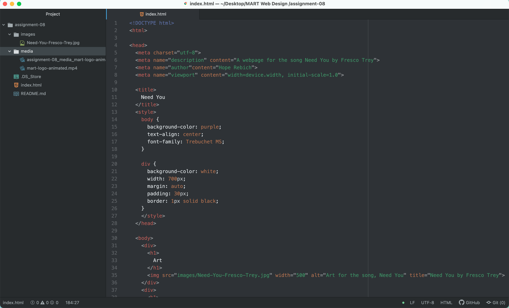

<h1>
What is an affordance?
</h1>

An affordance is basically a set of possible actions or an object. This object can be digital or physical and can be communicated to users through visual, tactile, and auditory. For purposes of this class, a digital object like the red "x" in the corners of our websites affords interactions related to closing or quitting a web page. Users must learn these affordances and can do this by interacting with it.  

<h1>
What are the advantages and disadvantages of using a third-party service like YouTube or Vimeo to host your videos?
</h1>

The advantages of using third-party services is that they are ideal for video and audio files, can host large, high-quality versions of files, and they will handle compatibility, encoding, and the other details necessary for the media to play on a variety of browsers. The disadvantages are they are not ideal for image files, any unlicenced materials used without permission can be crawled and reported, and lastly, they can become costly to upgrade storage or services.
