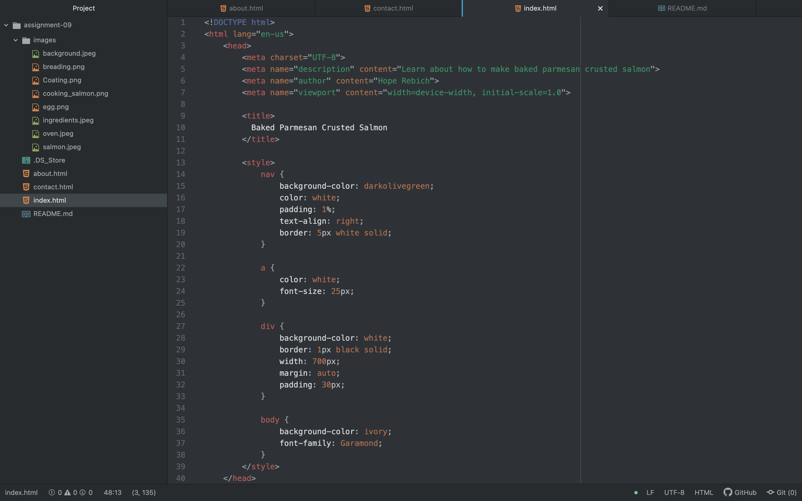

<h1>
Briefly recap your experience learning HTML. What was old, new, interesting, or difficult to learn?
</h1>

HTML has been very fun to learn. Coming into this class, I was familiar with some of the basics of HTML because I have previously taken a coding class that required me to learn HTML, so getting started in the class was smooth. The old concepts that I already knew was the head elements, as well as, some of the semantic markup. I did learn some new things like, how to format and make lists, and add in images and videos. The most interesting concept that I thought was difficult but fun to learn was how to make websites and also how to connect multiple pages. That was something that was brand new for me to learn.

<h1>
After we come back from spring break we will start to dive into CSS and expand on styling, which helps us "decorate" HTML. Is there anything you're anxious or excited to learn about in this new section?
</h1>

Now that we pretty much learned the basics of HTML and how to structure content on a web page, I am excited to learn CSS to add style to all my content. The one thing I am anxious about to learn is how we are going to add CSS to the HTML code. I am curious to see if its an easy process or a hard one. It seems confusing by thats what I said when I was introduced to HTML. I am always up for the excitment. 
