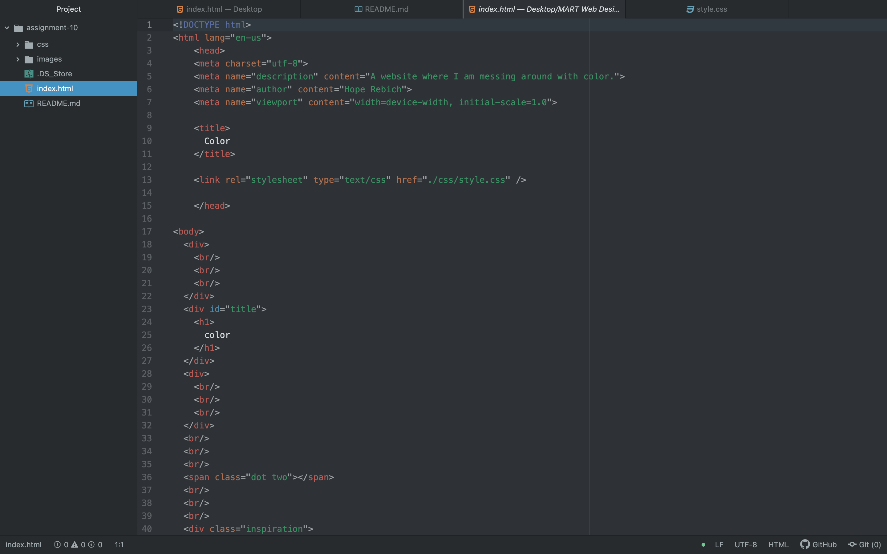

<h1>
Describe the difference between the universal, element, class, and id selector types. When might you choose one over the other to style content?
</h1>
The universal selector type is used to style every element on the page. The element selector is used to select all elements of a 'certain type'. The class selector is used to style elements when assigned to HTML elements. And last but not least, the id selector allows developers to define style rules for a specific element by calling its unique ID.

When I want to style a specific heading out of the other headings, I would use the element selector to choose my heading I want, and change either its color or size, or even both. I wouldn't want to use the universal selector because that would style all the elements.  

<h1>
Discuss your color palette. How did you choose your colors?
</h1>

For my color palette, I chose light gray, black, red, and pink. I chose these colors because they correlated directly with the painting I used as my inspiration. I liked graffiti art so when I was searching, I found Keith Haring's art and used that for my website and color palette.

<h1>
Optional: discuss any challenges you faced this week, and how you overcame them.
</h1>

One challenge that I faced this week was getting the height and width right for my "inspiration" class. I had to mess with them to help them fit the picture of my artwork and make it look nice. Other than that, this was a pretty fun assignment.
