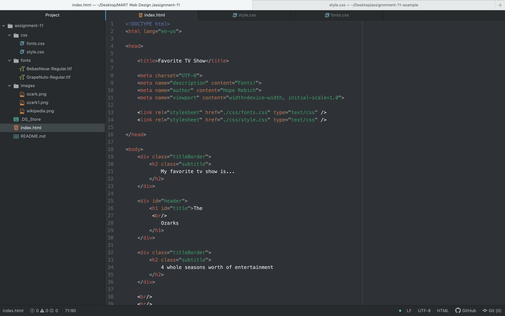

<h1>
What is typography?
</h1>

According to Wikipedia, "it is the art and technique of arranging type to make written languages legible, readable, and appealing when displayed." It's important for communication as it really invites your user into your webpage. It helps provide structure and order for your content as it is used as an organizational tool for your textual information.

<h1>
What is the importance of having fallback fonts or a font stack?
</h1>

It is important to have fallback fonts or a font stack because there can be instances where the primary fonts won't load, will load slowly, or fail, and so it will provide the next font in the stack to take its place while it is processing. This is also used for when the client doesn't have a font so it will then try the next listed font in the chain.

<h1>
What is the difference between a system font, web font, and web-safe font?
</h1>

System fonts are those already installed on your local device and system. They are almost always available to you  but are not necessarily to the web because they must be exported as images.

Web fonts are custom fonts hosted on a server. They do not have to be available on the user's device to appear, but require certain elements to get called up correctly. So different from system fonts.

If you want fonts that developers can count on as being available by the system, then your best bet would be web-safe fonts. Using fonts from a list helps reduce load times and increase performance because the client computer will already have the font.
