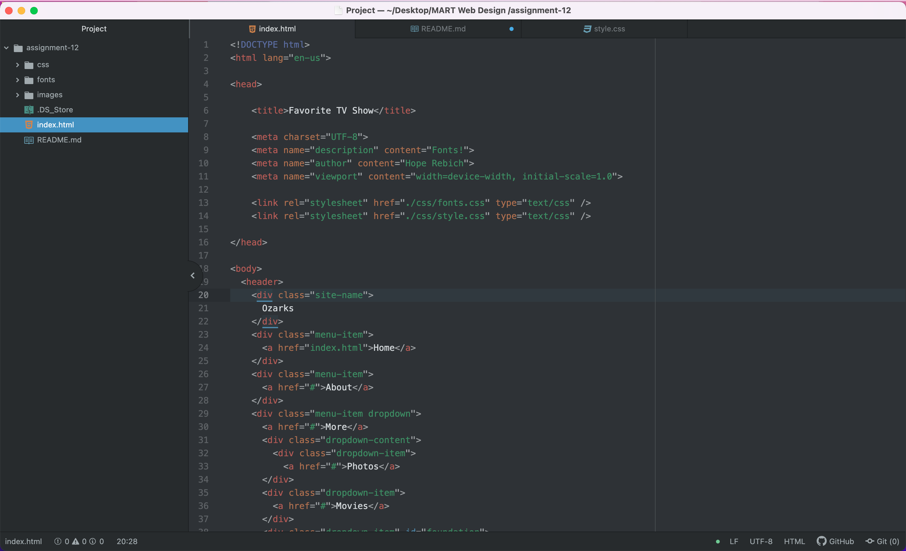

<h1>
What is the difference between padding, margin, and borders?
</h1>

Even though all three help define the amount of space a box or element takes up, they are all different in their own ways.

Borders can be separately colored and have multiple style options to become more of a visual styling tool rather than a space management tool.
Padding on the other hand, is the amount of space between the content in the inside of the element and the border. It is located in the inside while the border is located on the outside. Lastly, the margin is the space on the edge of the parent element. It is usually on the outside of the border.

<h1>
How did this week's assignment go? What challenges did you face, and how did you overcome them?
</h1>

This assignment was not too hard since I could build upon the a website that I had already made. The hard part for me was when we had to change the colors of all the padding and borders on my website. Some blended in and some I had to change to make my website look better. Just a lot of experimenting to get the right touch for my website. 
