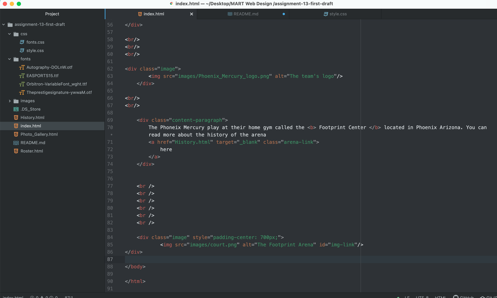

<h1>
What is the goal of your website? (Think in terms of your user -- why might they visit your site?)
</h1>

My main goal of my website is to share information about my favorite WNBA team. Users that either want to know more about my interests or want to gain information on this specific sports team; I have provided all the information all in one website, and why not make it interactive as we go! I want my users to learn about the WNBA and a specific team, as well as, have fun doing it and enjoying their time.

<h1>
Why is responsive web design important?
</h1>
Responsive web design is important because the technological age has grown. Now there are phones and tablets of all different sizes. Because of this, it is important to make sure that your website displays correctly on these screens.

This type of web design is about using HTML and CSS to resize, hide, shrink, or enlarge, a website to make it look good on all devices, and not just one.
Since the amount of mobile traffic now accounts for more than half of total internet traffic, responsive design is just as important.
